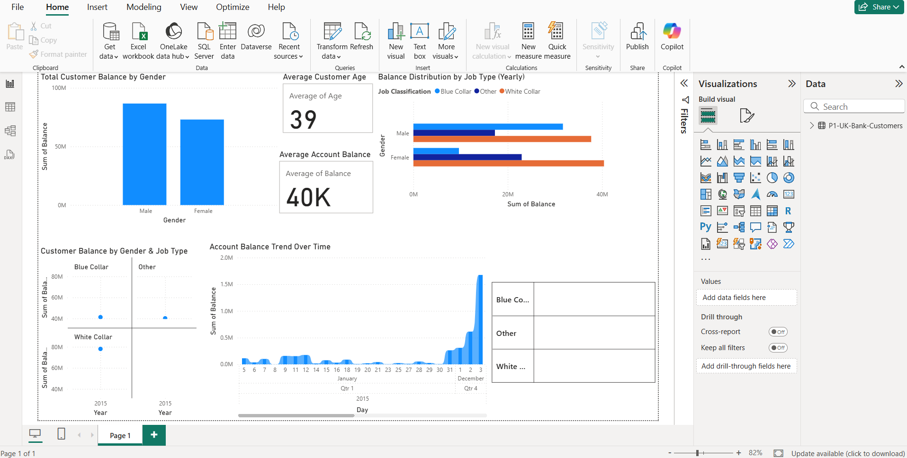
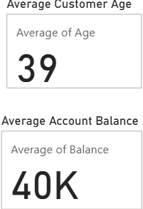
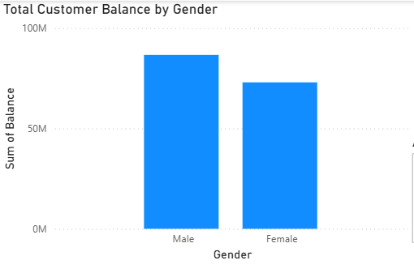

# 📊 Power BI – UK Bank Customers Analysis

This project analyzes **UK bank customer data** using **Microsoft Power BI** to uncover insights related to customer demographics, account balances, and time-based trends.

The dashboard is designed to help stakeholders understand **customer behavior**, **balance distribution**, and **growth patterns** for better decision-making.

---

## 🧩 Dataset Overview

The dataset includes:

- Customer gender
- Age
- Job classification (Blue Collar, White Collar, Other)
- Account balance
- Time-based transaction data

---

## 📌 Dashboard Overview

This dashboard provides a consolidated view of all key metrics and trends related to UK bank customers.

---

## 📍 Key Metrics

### Metrics Included:
- **Total Customers**
- **Average Customer Age**
- **Average Account Balance**

🔍 **Insight:**  
The average customer age is around **38 years**, with a balanced distribution of account values across customers.

---

## 👥 Balance by Gender

🔍 **Insights:**
- Male customers hold slightly higher total balances compared to female customers.
- White-collar customers dominate balance contribution across both genders.

---

## 📈 Balance Trend Over Time

🔍 **Insights:**
- Strong growth in balances toward the later months.
- End-of-year periods show significant spikes, indicating seasonal or bonus-driven deposits.

---

## 🛠 Tools & Technologies Used

- **Microsoft Power BI**
- **Power Query** for data cleaning
- **DAX** for calculated measures
- **GitHub** for project versioning and portfolio sharing

---

## 📁 Project Files

| File Name | Description |
|---------|------------|
| `UK_Bank_Customers_Analysis.pbix` | Power BI dashboard file |
| `dashboard_overview.png` | Full dashboard snapshot |
| `key_metrics.png` | KPI cards snapshot |
| `balance_by_gender.png` | Gender-based balance analysis |
| `balance_trend_over_time.png` | Time-based balance trend |
| `README.md` | Project documentation |

---

## 🎯 Key Learnings

- Hands-on experience with **real-world financial data**
- Strong understanding of **data modeling and DAX**
- Ability to convert raw data into **business insights**
- Professional dashboard design for stakeholders

---

## 👨‍💼 Author

**Arjun Sharma**  
Aspiring Data Analyst | Power BI | SQL | Excel  

📌 *This project is part of my analytics portfolio and is open for feedback and discussion.*
